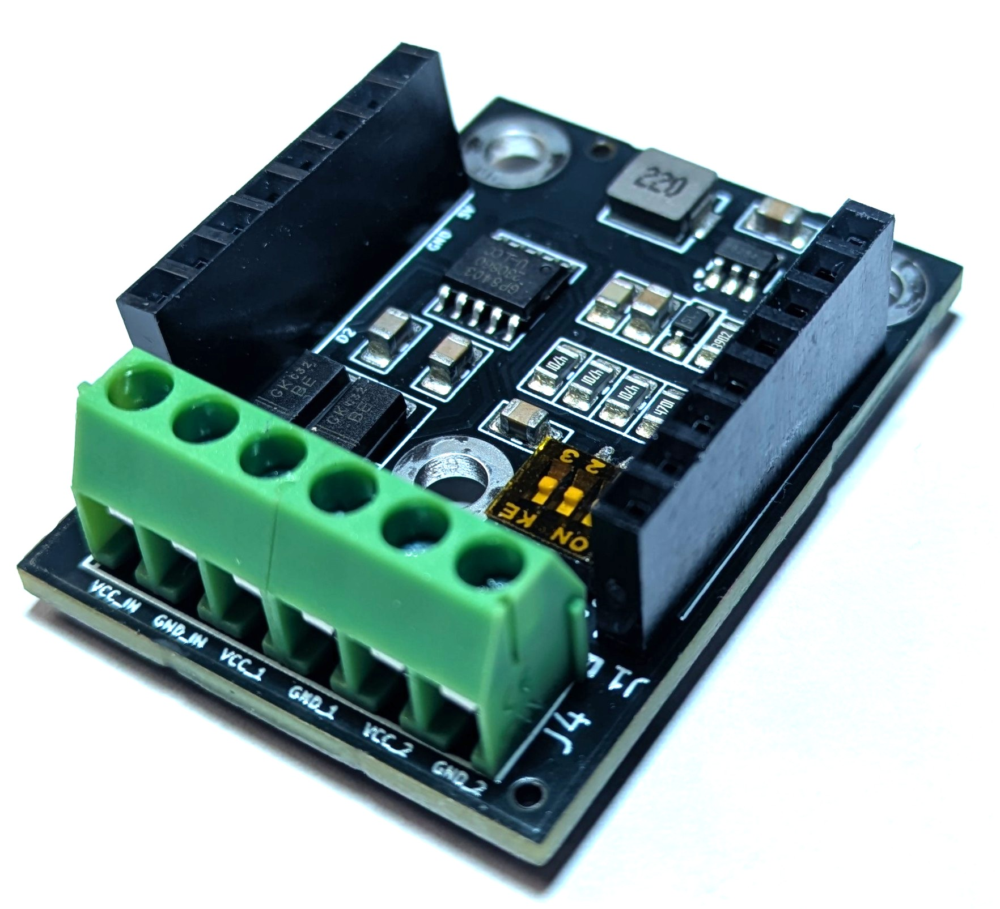
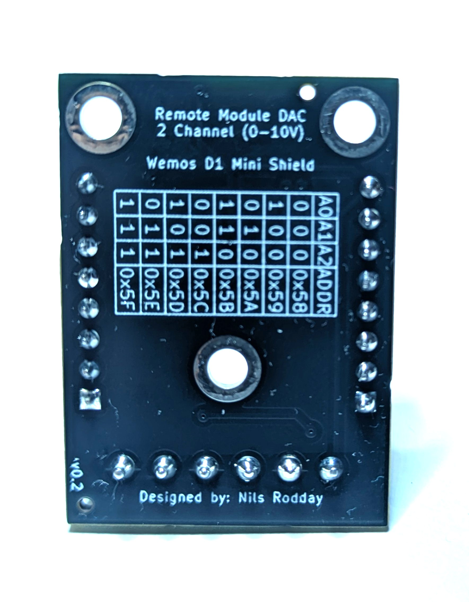
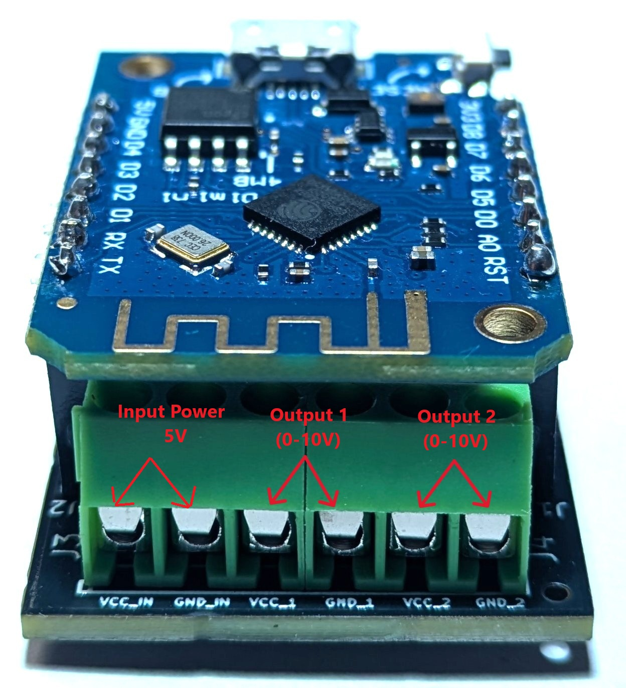

Digital to Analog Converter Shield
===========================

==================  ==================  
 |TOP_IMG|_           |BOTTOM_IMG|_  
==================  ==================

.. _TOP_IMG: ../_static/d1_shields/dac_v0.1_front.jpg

.. _BOTTOM_IMG: ../_static/d1_shields/dac_v0.1_back.jpg

I2C Digital-to-Analog Shield with 2x 0-10V Outputs based on GP8403
`[Buy on Tindie]`_

.. _[Buy on Tindie]: https://www.tindie.com/products/nilsrodday/wemos-d1-mini-dac-i2c-shield-2-channel-0-10v-out/

Block Terminal Layout
----------------------

5V Input, 2x 0-10V Output.

PINS used
#################

===  =====  ==========
1    3V3
2    SCL    D1 (IO5)
3    SDA    D2 (IO4)
4    GND
===  =====  ==========

I2C Addresses
#####################

===  ==========
000  0x58
100  0x59
010  0x5A
110  0x5B
001  0x5C
101  0x5D
011  0x5E
111  0x5F
===  ==========

Code for HomeAssistant
#####################

`[GitHub Repository]`_

.. _[GitHub Repository]: https://github.com/nrodday/DAC2Ch