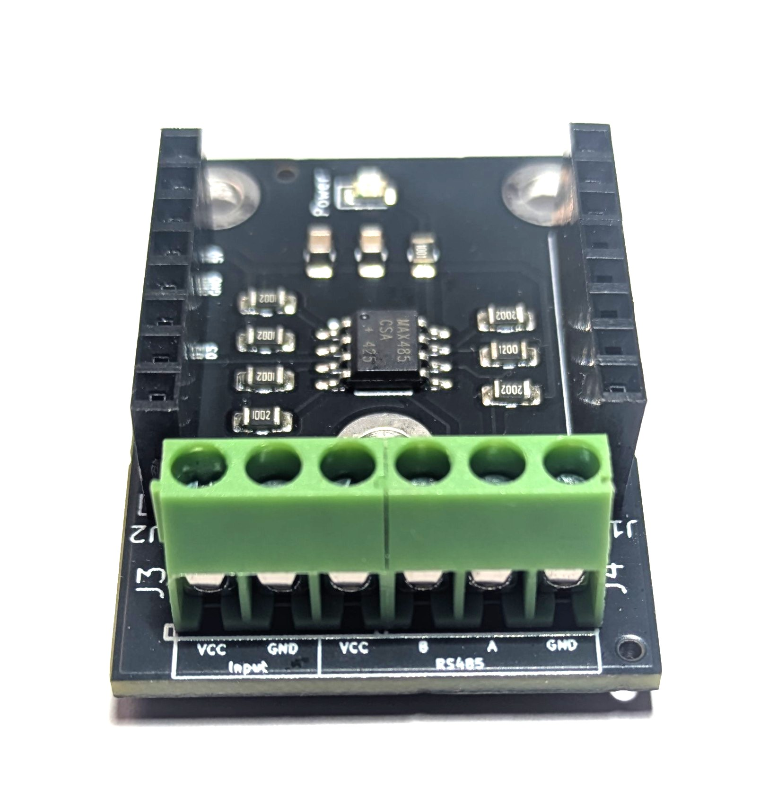
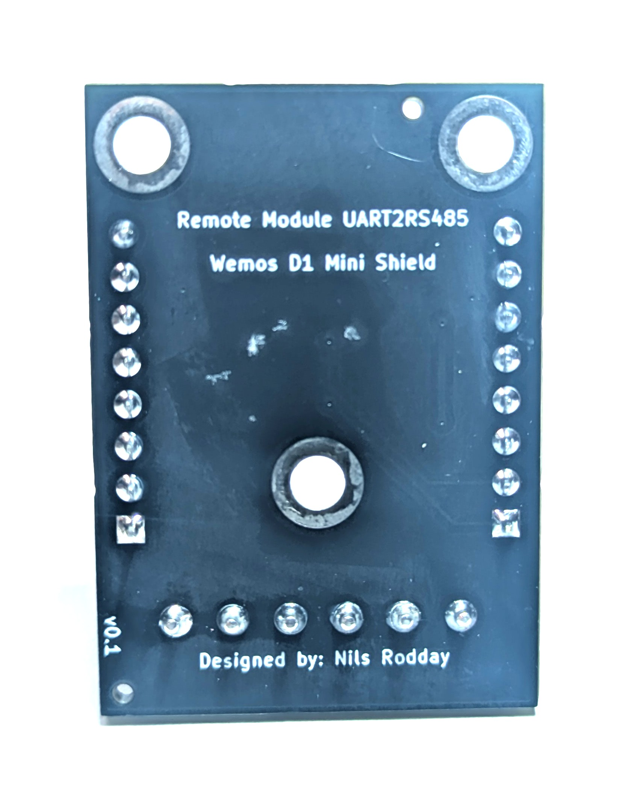
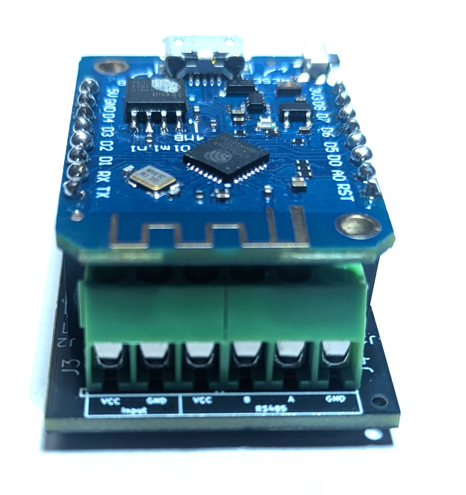

RS485 Shield
===========================

==================  ==================  
 |TOP_IMG|_           |BOTTOM_IMG|_  
==================  ==================

.. _TOP_IMG: ../_static/d1_shields/rs485_v0.1_front.jpg

.. _BOTTOM_IMG: ../_static/d1_shields/rs485_v0.1_back.jpg

RS485 Modbus Shield
`[Buy on Tindie]`_

.. _[Buy on Tindie]: https://www.tindie.com/products/nilsrodday/wemos-d1-mini-shield-uart-to-rs485/

Block Terminal Layout
----------------------

5V Input, RS485 interface (VCC,B,A,GND)

PINS used
#################

===  =====  ==========
1    5V
2    TX     D8 (IO15)
3    RX     D7 (IO13)
4    GND
5    Ctrl	D3 (IO0)
===  =====  ==========

Code for HomeAssistant
#####################

`[GitHub Repository]`_

.. _[GitHub Repository]: https://github.com/nrodday/UART2RS485